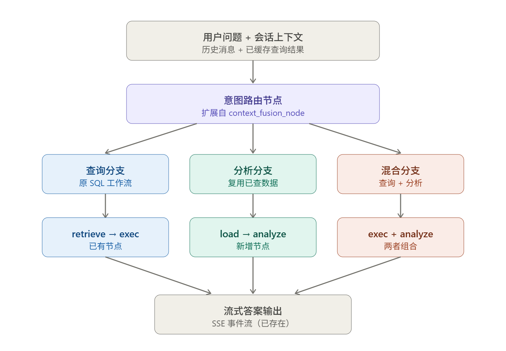

# DataLens / SQL Agent 2.0

DataLens 是一个面向企业业务数据的自然语言问数系统。用户可以用中文提出业务问题，系统会结合会话上下文、表结构元数据、历史查询结果和用户权限，自动生成安全的 PostgreSQL `SELECT` 查询，并以流式方式返回自然语言答案、SQL、解释和表格结果。

本项目适用于偿付能力、经营指标、风险管理、业务明细等结构化数据分析场景，重点解决“业务人员不会写 SQL，但需要快速查询和追问数据”的问题。

## 核心能力

- 中文自然语言问数：输入业务问题即可查询 PostgreSQL 中的授权数据。
- SQL 自动生成与校验：通过 LangGraph 多阶段工作流完成问题理解、表检索、表选择、JOIN 规划、SQL 生成、SQL 安全校验和执行。
- SSE 流式回答：前端实时展示生成进度、答案片段、SQL、解释和结果表格。
- 多轮追问与结果复用：支持基于历史对话和已缓存查询结果继续分析、对比和补充查询。
- 表级权限控制：通过 RBAC 和表分组限制用户只能查询已授权数据表。
- 管理后台：支持用户、角色、表分组、快捷问题、数据上传、业务表注释维护、向量库同步和审计日志查看。
- 向量检索增强：使用 Milvus 检索业务表结构，降低 LLM 选错表、漏字段的概率。
- 审计与追踪：查询过程、SQL、执行结果和错误信息可持久化，便于排查和治理。

## 产品使用流程

1. 用户登录系统，进入问数页面。
2. 在页面顶部选择可访问的数据分组，例如偿付能力指标、经营指标或其他业务分组。
3. 在输入框中提出中文问题，例如“查询最近一期偿付能力充足率排名前 10 的公司”。
4. 系统流式返回处理状态、自然语言答案、生成的 SQL、查询解释和表格结果。
5. 用户可以继续追问，例如“只看人身险公司”或“和上一期相比变化如何”。
6. 管理员可在 `/admin` 后台维护用户权限、表分组、数据文件、业务注释和向量库同步状态。

## 架构概览

项目采用前后端分离架构：

- 前端：React 18、TypeScript、Vite、React Router、Axios、EventSource/SSE。
- 后端：FastAPI、Uvicorn、Pydantic Settings。
- Agent 工作流：LangGraph、LangChain、OpenAI 兼容 ChatOpenAI 接口。
- 数据库：PostgreSQL、SQLAlchemy 同步/异步引擎、Alembic。
- 向量库：Milvus，保存业务表结构向量索引。
- 缓存与队列：Redis、Celery。
- 文件处理：pandas、openpyxl、xlrd。

查询路由示意：



## 快速启动

### 1. 准备外部依赖

本地运行前需要准备：

- Python 3.12 或兼容版本
- Node.js 20 或兼容版本
- PostgreSQL
- Redis
- Milvus
- OpenAI 兼容 LLM 服务，例如 vLLM、Ollama 或企业内部模型服务
- 本地 HuggingFace embedding 模型，例如 bge-m3

### 2. 配置后端环境变量

在 `backend/.env` 中配置运行参数。示例：

```env
PG_HOST=localhost
PG_PORT=5432
PG_DATABASE=sql_agent_db
PG_USER=postgres
PG_PASSWORD=change-me
PG_SCHEMA=sql_agent
PG_PUBLIC_SCHEMA=public

LLM_BASE_URL=http://localhost:8000/v1
LLM_MODEL_NAME=your-model-name
LLM_API_KEY=not-needed

EMBEDDING_MODEL_PATH=D:/models/bge-m3

MILVUS_HOST=localhost
MILVUS_PORT=19530
MILVUS_USER=root
MILVUS_PASSWORD=

REDIS_URL=redis://localhost:6379/0
CELERY_BROKER_URL=redis://localhost:6379/1
CELERY_RESULT_BACKEND=redis://localhost:6379/2

JWT_SECRET_KEY=change-this-secret
AUTO_SYNC_ON_STARTUP=false
```

不要把生产数据库密码、JWT 密钥或 LLM API Key 提交到仓库。

### 3. 启动后端

```powershell
cd backend
python -m venv .venv
.\.venv\Scripts\Activate.ps1
pip install -r requirements.txt
alembic upgrade head
python scripts/create_admin.py --email admin@example.com --password change-me
uvicorn server:app --host 0.0.0.0 --port 8080
```

后端默认地址：

- API: `http://localhost:8080`
- 健康检查: `http://localhost:8080/health`

### 4. 启动前端

```powershell
cd frontend
npm install
npm run dev
```

前端默认地址：

- Web 应用: `http://localhost:3002`
- 登录页: `http://localhost:3002/login`
- 管理后台: `http://localhost:3002/admin`

Vite 开发服务器会把 `/api`、`/auth`、`/admin`、`/profile` 代理到 `http://localhost:8080`。

## 常用命令

后端：

```powershell
cd backend
pytest
uvicorn server:app --host 0.0.0.0 --port 8080
celery -A tasks:celery_app worker --loglevel=info
```

前端：

```powershell
cd frontend
npm run typecheck
npm run test
npm run build
npm run preview
```

接口入口：

- 查询：`GET /api/query?q=...&session_id=...&run_id=...`
- 恢复查询流：`GET /api/query/resume?run_id=...&from_event_id=...`
- 取消查询：`POST /api/query/cancel`
- 健康检查：`GET /health`

## 目录结构

```text
backend/
  server.py          FastAPI 应用入口和路由注册
  config.py          环境变量和运行参数
  api/               查询、认证、会话、个人配置、快捷问题和管理端接口
  auth/              JWT、密码、鉴权依赖和 RBAC 表级权限
  db/                SQLAlchemy 连接、ORM 模型和 CRUD
  graph/             LangGraph 状态、节点、提示词和工作流装配
  services/          向量同步、查询运行状态和管理端数据上传管线
  vectorstore/       Milvus collection 和 embedding 封装
  tasks/             Celery 异步任务
  alembic/           数据库迁移
  tests/             后端测试

frontend/
  src/App.tsx        前端路由入口
  src/pages/         登录页、聊天页、管理后台
  src/components/    布局、聊天消息、SQL 展示和管理端组件
  src/hooks/         聊天、认证等状态逻辑
  src/services/      auth、chat、admin API 封装
  vite.config.ts     Vite 开发服务器和代理配置

docs/
  technical-architecture.md   技术架构说明
  backend-query-pipeline.md   查询链路说明
```

## 扩展文档

- [技术架构文档](docs/technical-architecture.md)
- [用户查询处理链路](docs/backend-query-pipeline.md)

## 生产部署提示

生产环境建议单独管理 `.env`、模型服务、数据库、Redis、Milvus 和前端静态资源服务。前端目录提供了 `Dockerfile` 和 `nginx.conf`，可用于构建静态站点镜像；后端建议结合进程管理、日志采集、数据库备份和密钥管理系统部署。
