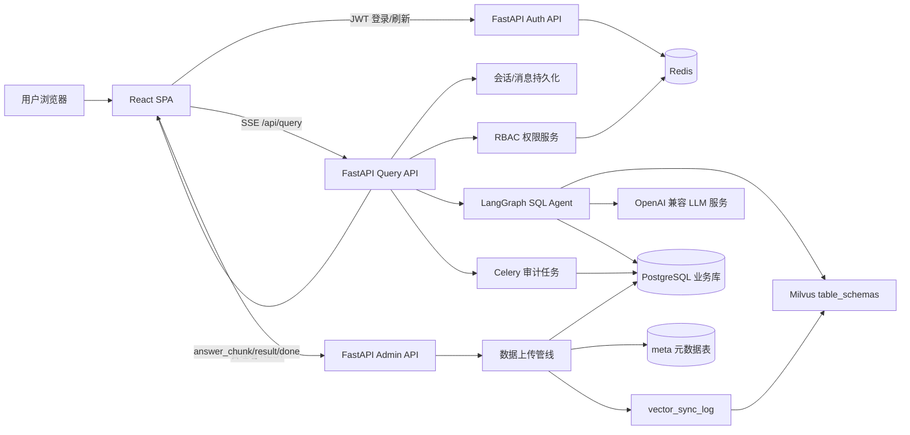
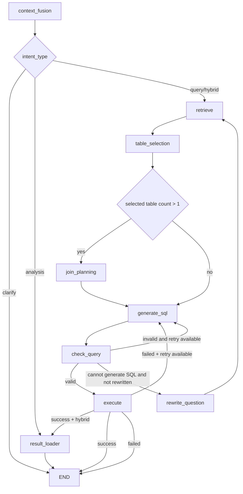

# SQL Agent 2.0 技术架构文档

## 1. 项目定位

本项目是一个面向企业业务数据的自然语言问数系统。用户在前端输入中文问题后，后端会结合会话上下文、历史查询结果、数据表元数据和用户权限，通过 LangGraph 编排多阶段 LLM 工作流，生成安全的 `SELECT` SQL，执行 PostgreSQL 查询，并以 SSE 流式返回自然语言答案、SQL、解释和表格结果。

项目同时提供管理后台，用于用户/角色/表分组管理、Excel/CSV 数据上传、业务表注释维护、向量库同步和审计日志查看。

核心目标：

- 让用户用自然语言查询 PostgreSQL 业务数据。
- 通过 Milvus 检索表结构，降低 LLM 选错表、漏字段的概率。
- 通过 RBAC 表级白名单和 SQL 校验，控制用户只能查询授权数据。
- 通过会话、消息和查询结果快照支持多轮追问、结果分析和混合查询。
- 通过管理端上传数据文件，自动生成/维护逻辑元数据并同步向量库。

## 2. 技术栈

| 层级 | 技术 |
| --- | --- |
| 前端 | React 18、TypeScript、Vite、React Router、Axios、EventSource/SSE |
| 后端 Web | FastAPI、Uvicorn、Pydantic Settings |
| Agent 编排 | LangGraph、LangChain、ChatOpenAI 兼容接口 |
| 数据库 | PostgreSQL、SQLAlchemy 同步/异步引擎、Alembic |
| 向量库 | Milvus、HNSW 索引、COSINE 相似度 |
| Embedding | `langchain-huggingface` 本地 HuggingFace Embeddings |
| 缓存/队列 | Redis、Celery |
| 数据文件处理 | pandas、openpyxl、xlrd |
| SQL 处理 | sqlparse、sqlglot |
| 测试 | pytest、Vitest、TypeScript typecheck |

## 3. 代码目录

```text
backend/
  server.py                     FastAPI 应用入口和路由注册
  config.py                     环境变量和运行参数
  api/                          查询、认证、会话、个人配置、快捷问题等接口
  api/admin/                    管理端接口：用户、角色、表、分组、向量库、审计
  auth/                         JWT、密码、鉴权依赖、RBAC 表级权限
  db/                           SQLAlchemy 连接、ORM 模型、CRUD
  graph/                        LangGraph 状态、节点、提示词、工作流装配
  services/                     向量同步、管理端数据上传管线
  vectorstore/                  Milvus collection 和 embedding 封装
  tasks/                        Celery 异步任务
  utils/                        数据加载、元数据生成、日志、SQL 工具
  alembic/                      数据库迁移
  tests/                        后端测试

frontend/
  src/App.tsx                   路由入口
  src/contexts/AuthContext.tsx  登录态和用户信息上下文
  src/hooks/useChat.ts          聊天页核心状态与 SSE 流处理
  src/services/                 auth/chat/admin API 封装
  src/pages/                    登录、聊天、管理后台页面
  src/components/               布局、聊天消息、SQL 展示、管理端组件
  vite.config.ts                Vite 开发代理
```

## 4. 总体架构



架构上这是一个单体后端应用，而不是微服务。查询、管理、权限、元数据和向量同步都在一个 FastAPI 服务内维护，外部依赖集中在 PostgreSQL、Redis、Milvus、LLM 服务和可选 Celery Worker。这样部署复杂度较低，也便于保证权限和元数据逻辑的一致性。

## 5. 后端应用入口

入口文件是 `backend/server.py`。

主要职责：

- 创建 `FastAPI(title="DataLens API", version="2.0.0")`。
- 注册 CORS。
- 加载 `.env` 和 LangSmith 环境变量。
- 在 lifespan 启动阶段可选初始化 Milvus collection。
- 在应用退出时关闭 Redis 和异步数据库连接池。
- 注册认证、查询、会话、快捷问题、个人配置和管理端路由。
- 提供 `/health` 健康检查。
- 提供 `/api/workflow/graph` 生成 LangGraph Mermaid PNG。

已注册的主要接口：

| 模块 | 路径 |
| --- | --- |
| 认证 | `/auth/login`、`/auth/refresh`、`/auth/logout` |
| 查询 | `GET /api/query`、`POST /api/query/cancel` |
| 会话 | `/api/sessions/*` |
| 快捷问题 | `/api/quick-questions/*` |
| 个人配置 | `/profile`、`/profile/table-groups`、`/profile/change-password` |
| 管理用户 | `/admin/users/*` |
| 管理角色 | `/admin/roles/*` |
| 表与分组 | `/admin/tables/*`、`/admin/table-groups/*` |
| 向量库 | `/admin/vectorstore/*` |
| 审计 | `/admin/audit` |

## 6. 配置模型

配置集中在 `backend/config.py` 的 `Settings`，通过 `pydantic-settings` 从 `backend/.env` 和环境变量读取。

关键配置：

| 配置 | 说明 |
| --- | --- |
| `pg_host`、`pg_port`、`pg_database`、`pg_user`、`pg_password` | PostgreSQL 连接信息 |
| `pg_schema` | 业务数据表所在 schema，默认 `sql_agent` |
| `pg_public_schema` | 公共应用表 schema，默认 `public` |
| `llm_base_url`、`llm_model_name`、`llm_api_key` | OpenAI 兼容 LLM 接口 |
| `embedding_model_path` | 本地 embedding 模型路径 |
| `milvus_host`、`milvus_port`、`milvus_user`、`milvus_password` | Milvus 连接信息 |
| `redis_url` | Redis 连接 |
| `jwt_secret_key`、`jwt_algorithm`、`access_token_expire_minutes` | JWT 配置 |
| `celery_broker_url`、`celery_result_backend` | Celery Broker 和结果后端 |
| `retrieval_top_k` | 向量检索返回表数量 |
| `max_retry_count` | SQL 生成/执行失败最大重试次数 |
| `max_history_turns` | 查询时携带的最大历史对话轮数 |
| `upload_staging_dir` | 管理端上传文件暂存目录 |

PostgreSQL 同步连接串会设置 `search_path`：

```text
pg_public_schema,meta,pg_schema
```

这使应用表、元数据表和业务表在 SQL 执行中都能被访问。异步 `asyncpg` 引擎不直接使用 `options` 参数，而是单独构造异步连接 URL。

## 7. 数据库设计

### 7.1 三类 schema

项目实际使用三类数据空间：

| schema | 用途 |
| --- | --- |
| `public` | 应用自身表，如用户、角色、会话、消息、审计、快捷问题、表分组 |
| `meta` | 业务表逻辑元数据、上传历史、向量同步日志 |
| `pg_schema` | 可配置业务数据 schema，默认 `sql_agent`，保存真实被查询的数据表 |

### 7.2 应用 ORM 模型

核心 ORM 定义在 `backend/db/models.py`。

| 表 | 作用 |
| --- | --- |
| `users` | 用户账号、密码哈希、启停状态 |
| `roles` | 角色 |
| `permissions` | 资源权限，当前保留 schema/table/action 结构 |
| `user_roles` | 用户和角色多对多 |
| `role_permissions` | 角色和权限多对多 |
| `table_groups` | 数据表分组，作为前端选择和角色授权单位 |
| `table_group_members` | 分组和物理表的绑定，记录 `table_schema` + `table_name` |
| `role_table_groups` | 角色和表分组多对多 |
| `sessions` | 聊天会话 |
| `messages` | 用户/助手消息，助手消息 metadata 保存 SQL、结果、状态等 |
| `query_results` | 会话级查询结果快照，供后续分析/追问引用 |
| `quick_questions` | 用户快捷问题，绑定表分组 |
| `audit_logs` | 查询审计日志 |
| `refresh_tokens` | Refresh Token 哈希、过期和撤销状态 |

### 7.3 meta 元数据表

`meta` schema 由 Alembic 迁移创建，关键表包括：

| 表 | 作用 |
| --- | --- |
| `meta.logical_tables` | 逻辑表目录，保存物理 schema、物理表名、中文显示名、表注释、状态等 |
| `meta.logical_columns` | 逻辑列目录，保存字段名、原始列名、数据类型、列注释、是否启用等 |
| `meta.upload_history` | 文件上传历史、文件 hash、目标表、分组、动作类型、LLM 生成建议、失败原因等 |
| `meta.vector_sync_log` | 待同步到 Milvus 的 upsert/delete 任务及重试状态 |

设计重点是 PostgreSQL 作为元数据真相源，Milvus 只是可重建的检索副本。上传应用成功、表元数据编辑后会先写 PostgreSQL 和 `meta.vector_sync_log`，再后台同步 Milvus；字段详情里的字段注释手动编辑只写 PostgreSQL 和 `meta.vector_sync_log`，需要管理员在向量同步页点击增量同步后才写入 Milvus。

## 8. 认证与权限

认证接口在 `backend/api/auth.py`，JWT 和密码工具在 `backend/auth/jwt_handler.py`，鉴权依赖在 `backend/auth/dependencies.py`。

登录流程：

1. 用户提交 email 和 password。
2. 后端查询用户并校验 passlib bcrypt 哈希。
3. 禁用用户直接拒绝。
4. 生成 access token，payload 包含用户 ID 和角色。
5. 生成 refresh token，只保存 hash 到 `refresh_tokens`。
6. 前端将 access token 和 refresh token 保存到 `localStorage`。

刷新流程：

1. 前端 Axios 遇到 401 后调用 `/auth/refresh`。
2. 后端校验 refresh token hash、撤销状态和过期时间。
3. 旧 refresh token 标记 revoked。
4. 生成新的 access/refresh token。

表级 RBAC 在 `backend/auth/rbac.py`。

权限语义：

- `allowed_tables is None`：管理员，无表级限制。
- `allowed_tables == []`：普通用户没有任何授权表，查询入口直接返回错误。
- `allowed_tables == ["table_a", ...]`：普通用户只能查询白名单中的表。

权限来源：

1. `get_user_allowed_tables()` 先查 Redis，key 为 `rbac:{user_id}:tables`，TTL 300 秒。
2. 未命中时查询数据库角色与表分组，得到可访问表名列表。
3. 用户/角色/分组权限变化时调用缓存失效函数。

权限在两个阶段生效：

- 检索阶段：过滤 Milvus 返回的表结构，只给 LLM 授权表。
- SQL 校验阶段：从生成 SQL 中提取引用表名，检查是否全部在白名单内。

同时前端查询会传入 `group_id`，后端会计算“当前分组表集合”和“用户授权表集合”的交集，作为本次 Milvus 检索范围。

## 9. 自然语言查询链路

查询入口在 `backend/api/query.py`：

```http
GET /api/query?q=...&session_id=...&run_id=...&group_id=...
```

该接口使用 Server-Sent Events。由于浏览器原生 `EventSource` 不方便设置 `Authorization` header，前端会把 access token 作为 query 参数传入，后端使用 `get_current_user_from_header_or_query` 同时兼容 header 和 query token。

### 9.1 请求处理步骤

1. 校验问题、`session_id`、`run_id`。
2. 校验会话归属当前用户。
3. 从 Redis/DB 获取用户授权表白名单。
4. 加载最近历史消息，格式化为对话上下文。
5. 加载当前会话最近查询结果摘要，供追问分析引用。
6. 根据 `group_id` 计算本次表分组过滤列表。
7. 先保存用户消息，并创建一个空的助手消息占位，状态为 `streaming`。
8. 创建 `asyncio.Queue`，后台任务执行 LangGraph，同步生成器通过 `asyncio.to_thread()` 转成异步事件。
9. SSE 生成器从队列取事件并推送给前端。
10. 后台任务结束后，无论客户端是否断开，都更新助手消息、保存查询结果快照、写入审计任务。

这里特意把工作流放到后台任务中，并用模块级 `_BACKGROUND_TASKS` 保存强引用，避免客户端断开导致任务被 GC，进而丢失 DB 持久化。

### 9.2 SSE 事件

后端会推送如下事件：

| `type` | 说明 |
| --- | --- |
| `status` | 当前阶段状态，如检索到表、SQL 校验通过、正在生成答案 |
| `intent` | 上下文融合后的意图类型、引用的历史结果、置信度和原因 |
| `answer_chunk` | LLM 自然语言答案 token 片段 |
| `explanation` | 使用了哪些表、为什么使用这些表 |
| `result` | SQL 查询结果，包含 columns、rows、row_count |
| `done` | 正常完成，携带最终 GraphState |
| `stopped` | 用户取消 |
| `error` | 异常错误 |

### 9.3 取消机制

前端调用：

```http
POST /api/query/cancel
```

body：

```json
{ "run_id": "..." }
```

后端用 `_RUN_CONTROLS` 保存每个 `run_id` 的 `threading.Event`。LangGraph 流式运行过程中会在节点之间和答案生成过程中检查取消标记。取消后：

- 前端关闭 EventSource。
- 后端最终将助手消息状态更新为 `stopped`。
- 已生成的部分答案仍会落库。

## 10. LangGraph 工作流

核心文件：

- `backend/graph/state.py`
- `backend/graph/nodes.py`
- `backend/graph/prompts.py`
- `backend/graph/workflow.py`

### 10.1 GraphState

`GraphState` 是工作流共享状态，主要字段：

| 字段 | 说明 |
| --- | --- |
| `question` | 当前用于处理的问题，可能被改写 |
| `original_question` | 用户原始问题 |
| `conversation_history` | 最近历史对话 |
| `fused_question` | 上下文融合后的问题 |
| `question_type` | `standalone`、`continuation`、`ambiguous` |
| `intent_type` | `query`、`analysis`、`hybrid`、`clarify` |
| `available_results` | 当前会话可引用的历史查询结果摘要 |
| `referenced_result_ids` | 本轮引用的历史结果 ID |
| `sql_question` | hybrid 场景中需要新查数据的子问题 |
| `clarification_message` | clarify 场景中返回给用户的澄清提示 |
| `retrieved_schemas` | Milvus 检索到的表结构文档 |
| `selected_tables` | LLM 选择的表及原因 |
| `join_plan` | 多表 JOIN 计划 |
| `generated_sql` | 生成的 SQL |
| `sql_valid` | SQL 校验结果 |
| `execution_result` | SQL 执行结果 |
| `execution_success` | SQL 是否执行成功 |
| `retry_count` | 当前重试次数 |
| `allowed_tables` | 当前用户表级权限白名单 |
| `group_table_filter` | 当前查询限定的表分组 |
| `analysis_context` | 分析型回答使用的结构化上下文 |
| `final_answer` | 最终自然语言答案 |
| `query_explanation` | 查询表解释 |

### 10.2 节点职责

| 节点 | 作用 |
| --- | --- |
| `context_fusion_node` | 结合历史对话和历史查询结果，判断问题类型和意图，生成 `fused_question` / `sql_question` / `clarification_message` |
| `retrieve_node` | 对问题做 embedding，在 Milvus 中检索相关表结构，并应用表分组和 RBAC 过滤 |
| `table_selection_node` | LLM 从候选表中选择真正需要的表，输出选择理由 |
| `join_planning_node` | 多表场景下规划 JOIN 顺序、字段和 JOIN 类型 |
| `generate_sql_node` | 基于问题、表结构、JOIN 计划和错误上下文生成 SQL |
| `check_query_node` | 校验 SQL 语法、安全性、是否只读、是否越权 |
| `execute_node` | 使用 SQLAlchemy 同步引擎执行 SQL，返回结构化结果 |
| `rewrite_question_node` | SQL 明确无法生成时改写问题后重新检索 |
| `result_loader_node` | analysis/hybrid 场景加载历史查询结果快照，构造分析上下文 |
| `generate_answer_stream` | 图执行结束后，在图外流式生成最终答案和解释 |

### 10.3 主工作流



工作流不把答案生成放在 LangGraph 节点内。图只负责“理解问题、检索表、选表、生成 SQL、校验、执行、加载历史结果”。最终回答由 `generate_answer_stream()` 在图外执行，这样更容易把 token 通过 SSE 持续推给前端。

### 10.4 意图类型

`context_fusion_node` 支持四类意图：

- `query`：需要查询数据库。
- `analysis`：只基于历史查询结果回答，不再查询数据库。
- `hybrid`：同时引用历史结果，又需要查询新增数据，执行 SQL 后再合并分析。
- `clarify`：问题不是数据查询、查询条件不足、引用对象不明确，或要求分析但没有可引用历史结果；不查库，直接提示用户补充条件。

例如：

- “查询 2025 年偿付能力指标”通常是 `query`。
- “分析刚才结果里哪家公司异常”通常是 `analysis`。
- “把刚才 A 公司和 B 公司同口径比较一下”可能是 `hybrid`，如果 B 公司数据还未查询，则先生成 `sql_question` 查询缺失部分，再进行分析回答。
- “分析一下”且没有明确引用对象时是 `clarify`。

## 11. SQL 生成与安全校验

SQL 生成由 `generate_sql_node` 完成，Prompt 会注入：

- 融合后的问题或 hybrid 的 `sql_question`。
- 选中的表结构文档。
- 多表 JOIN 计划。
- 上一次错误上下文。
- 历史对话相关信息。

SQL 校验由 `check_query_node` 完成，核心策略：

1. 空 SQL 直接拒绝。
2. 检测危险关键字：`DROP`、`DELETE`、`TRUNCATE`、`ALTER`、`CREATE`、`INSERT`、`UPDATE`、`GRANT`、`REVOKE`。
3. 使用 `sqlparse.parse()` 做基本语法解析。
4. 只允许 `SELECT`。
5. 对普通用户提取 SQL 引用表，逐个校验是否在 `allowed_tables` 白名单。

执行由 `execute_node` 完成：

- 使用同步 SQLAlchemy engine。
- 返回 `columns`、`rows`、`row_count`。
- 执行失败会把错误写入状态，并触发重试路由。
- 成功但 `row_count == 0` 时不再自动改写问题，直接由回答生成器说明未查到数据和可能原因，避免把真实无数据误改成偏离用户意图的新查询。

## 12. 向量库设计

Milvus 封装在 `backend/vectorstore/milvus_store.py`。

当前只维护一个 collection：

```text
table_schemas
```

字段设计：

| 字段 | 说明 |
| --- | --- |
| `pk` | 逻辑表 ID |
| `embedding` | 表结构文档向量，维度 `512` |
| `physical_schema` | 物理 schema |
| `physical_name` | 物理表名 |
| `display_name` | 中文显示名 |
| `table_comment` | 表注释 |
| `column_count` | 字段数 |
| `status` | 表状态 |
| `doc_text` | 完整表结构文本，返回给 LLM |

索引：

```text
HNSW + COSINE
M = 16
efConstruction = 200
search ef = 64
```

检索流程：

1. `retrieve_node` 使用 `fused_question` 或 `sql_question` 做 embedding。
2. Milvus 在 `table_schemas` 中检索 Top-K。
3. 如果存在 `group_table_filter`，使用 Milvus expr 限定 `physical_name in [...]`。
4. 如果普通用户有 `allowed_tables`，再做一次 schema 文档级过滤。
5. 返回 `doc_text` 列表给 LLM 选表节点。

同步方式：

- `services.milvus_sync.enqueue_sync()` 在 PostgreSQL 事务内插入 `meta.vector_sync_log`。
- 未完成的同步任务按 `(target_id, target_type, op)` 去重；同一张表重复修改只刷新原 pending 记录的 `updated_at`，避免重复表级向量化。
- `flush_pending_syncs()` 消费 `pending` / `pending_retry` 行，执行 Milvus upsert/delete。
- `retry_failed_syncs()` 重置失败任务。
- `rebuild_all_from_pg()` 从 `meta.logical_tables` 和 `meta.logical_columns` 全量重建 collection。
- 字段详情页手动修改字段注释只入队 `meta.vector_sync_log`，不自动调用 `flush_pending_syncs()`；管理员需手动执行增量同步。

## 13. 管理端数据上传管线

入口在 `backend/api/admin/tables.py` 的：

```http
POST /admin/tables/upload
```

表单字段：

| 字段 | 说明 |
| --- | --- |
| `file` | Excel/CSV 文件 |
| `group_id` | 目标表分组，必填 |
| `target_table_id` | 更新已有表时传入逻辑表 ID |

处理步骤：

1. `write_staged_file()` 将文件写入暂存目录，并解析文件信息。
2. `decide_action()` 判断是新建表、仅追加数据，还是已有表字段变更。
3. 新建表时使用文件 hash 在同一表分组内去重，并调用 `propose_for_new_table()` 由 LLM 生成表名、字段名、注释等建议。
4. 写入 `meta.upload_history`。
5. `apply_upload()` 在同一事务内应用上传：
   - 新建表模式创建物理表，写入 `meta.logical_tables` / `meta.logical_columns`，并插入文件数据。
   - 更新已有表模式不清空旧数据；上传文件多出的字段会先调用 LLM 生成英文物理列名和中文字段注释，再自动 `ALTER TABLE ADD COLUMN`，字段类型统一为 `TEXT`，老数据新增列保持空值。
   - 更新已有表模式按“上传文件中原表已存在的共同字段”判断重复行，已有行跳过，新行追加；文件缺少的旧字段在新行中写入空值。
   - 绑定到 `table_group_members`，并写入 `vector_sync_log`。
6. 提交后通过 BackgroundTasks 触发 Milvus 同步。

其他管理能力：

- 更新表中文显示名：`PUT /admin/tables/{table_id}/display-name`
- 更新表注释：`PUT /admin/tables/{table_id}/comment`
- 更新字段注释：`PUT /admin/tables/{table_id}/columns/{col_id}/comment`（仅入队，需手动增量同步）
- 批量删除表：`DELETE /admin/tables/batch`
- 向量同步：`POST /admin/vectorstore/sync`
- 向量重建：`POST /admin/vectorstore/rebuild`
- 失败重试：`POST /admin/vectorstore/retry`
- 查看同步日志：`GET /admin/vectorstore/sync-log`

## 14. 前端架构

前端是 Vite + React SPA。

### 14.1 路由

`frontend/src/App.tsx` 定义三类页面：

| 路径 | 页面 |
| --- | --- |
| `/login` | 登录页 |
| `/` | 聊天页，需要登录 |
| `/admin` | 管理后台，需要登录 |

`RequireAuth` 通过 `AuthContext` 判断登录态，未登录时跳转 `/login`。

### 14.2 认证状态

`frontend/src/contexts/AuthContext.tsx` 负责：

- 启动时从 `localStorage` 读取 access token。
- 调用 `/profile` 获取当前用户。
- 登录后保存 token 并刷新用户信息。
- 登出后清理 token。

`frontend/src/services/api.ts` 封装 Axios：

- 请求拦截器自动注入 `Authorization: Bearer ...`。
- 响应拦截器遇到 401 自动调用 `/auth/refresh`。
- 刷新期间的并发请求进入队列，刷新成功后统一重放。

### 14.3 聊天状态

聊天页核心 Hook 是 `frontend/src/hooks/useChat.ts`。

管理的主要状态：

- 会话列表和当前会话 ID。
- 每个会话的消息列表。
- 正在进行的 SSE 流。
- 当前表分组。
- 快捷问题。
- 输入框内容。

发送消息流程：

1. 如果当前没有会话，先调用 `/api/sessions` 创建新会话。
2. 本地生成用户消息和空助手消息，立即插入 UI。
3. 生成 `run_id`，通过 `chatService.createQueryStream()` 创建 EventSource。
4. 监听 SSE：
   - `answer_chunk` 追加到助手消息。
   - `explanation` 写入消息解释。
   - `result` 写入表格结果。
   - `intent` 展示引用历史结果相关信息。
   - `done` 写入 SQL、intent、query_result_id 并结束流。
   - `stopped` 标记停止。
   - `error` 标记失败。
5. 首轮问答完成后调用 `/api/sessions/{id}/generate-title` 自动生成标题。

断线兜底：

- 后端会先创建助手消息占位并后台落库。
- 如果前端重新进入某个会话，发现最后一条助手消息仍是 `streaming`，会轮询 `/api/sessions/{id}/messages`，直到后台完成或超时。

### 14.4 管理后台

`frontend/src/pages/AdminPage.tsx` 使用侧边 Tab：

- 用户管理：`UsersTab`
- 角色权限：`RolesTab`
- 表与分组：`TablesTab`
- 向量同步：`VectorstoreTab`

API 封装在 `frontend/src/services/admin.ts`，与后端 `/admin/*` 接口一一对应。

## 15. 运行与部署

### 15.1 后端依赖

后端依赖在 `backend/requirements.txt`。运行前需要准备：

- PostgreSQL
- Redis
- Milvus
- 可访问的 OpenAI 兼容 LLM 服务
- 本地 embedding 模型路径

推荐启动顺序：

1. 启动 PostgreSQL、Redis、Milvus。
2. 配置 `backend/.env`。
3. 运行 Alembic 迁移。
4. 创建管理员用户。
5. 启动 FastAPI。
6. 可选启动 Celery Worker。
7. 启动前端开发服务或部署构建产物。

常用命令示例：

```bash
cd backend
alembic upgrade head
python scripts/create_admin.py
uvicorn server:app --host 0.0.0.0 --port 8080
```

Celery Worker：

```bash
cd backend
celery -A tasks worker -l info
```

Windows 环境下项目会默认使用 Celery `solo` worker pool，避免 Celery 默认 `prefork`
进程池在 Windows 上出现任务未进入业务代码就失败的问题。也可以显式启动：

```bash
celery -A tasks worker -l info -P solo
```

### 15.2 前端开发

```bash
cd frontend
npm install
npm run dev
```

Vite 默认监听 `0.0.0.0:3002`，并代理：

| 前端路径 | 代理目标 |
| --- | --- |
| `/api` | `http://localhost:8080` |
| `/auth` | `http://localhost:8080` |
| `/admin` | `http://localhost:8080` |
| `/profile` | `http://localhost:8080` |

### 15.3 前端构建部署

```bash
cd frontend
npm run build
```

`frontend/Dockerfile` 使用多阶段构建：

1. `node:20-alpine` 安装依赖并执行 `npm run build`。
2. `nginx:alpine` 托管 `dist` 静态产物。

## 16. 测试与验证

后端当前有 `backend/tests/test_analysis_routing.py` 和 `backend/tests/test_workflow_routing.py`，覆盖：

- `CONTEXT_FUSION_PROMPT` 的输入变量。
- analysis/hybrid/clarify 意图 JSON 解析。
- clarify 直接回答、无历史路由和历史结果默认引用收紧。
- 历史查询结果 ID 归一化。
- 历史结果引用权限过滤。
- 分析上下文构建、行数截断和数值列统计。
- 查询结果摘要生成。

运行：

```bash
cd backend
pytest
```

前端可运行：

```bash
cd frontend
npm run typecheck
npm run build
```

## 17. 关键设计取舍

### 17.1 单体后端

当前系统采用单体 FastAPI 后端，所有业务接口、权限、工作流和管理端能力集中在一个进程中。

优点：

- 部署简单。
- 权限、会话、元数据和查询链路更容易保持一致。
- 开发阶段调试成本低。

代价：

- 长时间 LLM/SQL 查询会占用后端资源。
- 管理端上传、向量同步和在线查询共享同一应用边界，需要更严格的连接池和任务隔离。

当前通过后台任务、Celery、Redis、连接池和查询取消机制缓解。

### 17.2 PostgreSQL 是真相源，Milvus 是可重建索引

所有业务表、逻辑元数据、上传历史和同步状态都在 PostgreSQL。Milvus 只保存用于 RAG 的表结构向量。

优点：

- Milvus 损坏或漂移时可以从 PostgreSQL 全量重建。
- 上传和注释编辑先提交到 PG，不受向量库短暂不可用影响。

代价：

- 向量同步可能短暂滞后。
- 需要管理 `vector_sync_log` 的失败重试和状态监控。

### 17.3 表分组作为授权和查询范围

系统没有直接让普通用户选择任意表，而是通过表分组组织业务域：

- 前端选择表分组。
- 角色被授权到表分组。
- 后端把角色权限和当前分组求交集。
- Milvus 检索和 SQL 校验都围绕这个结果执行。

这样可以让“业务域隔离”和“权限授权”共用同一套模型。

### 17.4 答案生成放在图外

LangGraph 负责结构化决策和数据库动作，最终自然语言答案在图外流式生成。

优点：

- SSE token 推送逻辑更简单。
- 图状态更聚焦于检索、生成 SQL、校验和执行。
- 取消和断线持久化更容易处理。

代价：

- 图本身不能完整表达“答案生成”阶段，需要在文档和日志中额外说明。

## 18. 风险与改进方向

| 风险 | 当前缓解 | 后续建议 |
| --- | --- | --- |
| LLM 生成错误 SQL | SQL 校验、危险关键字检测、只允许 SELECT、重试 | 引入 sqlglot AST 更完整解析、增加数据库只读账号 |
| 用户越权查询 | 检索过滤 + SQL 表名白名单校验 | 对带 schema、别名、子查询、CTE 的复杂 SQL 做更强表名抽取 |
| Milvus 同步滞后 | `vector_sync_log`、手动 sync/rebuild/retry | 增加定时 Worker 和可观测告警 |
| SSE 断线 | 后台任务继续执行、消息占位、前端轮询兜底 | 增加服务端查询状态 API |
| 长查询占用资源 | 取消机制、Uvicorn 并发限制 | 增加 SQL 超时、结果行数上限、连接池隔离 |
| Redis 缓存权限陈旧 | 权限变更时失效缓存、TTL 300 秒 | 在所有权限写路径统一封装缓存失效 |
| 文档/源码中文编码不一致 | 新文档使用 UTF-8 | 统一仓库文件编码并修复已有乱码注释 |

## 19. 扩展指南

### 19.1 增加新的 LangGraph 节点

1. 在 `backend/graph/state.py` 增加需要共享的状态字段。
2. 在 `backend/graph/prompts.py` 增加 Prompt。
3. 在 `backend/graph/nodes.py` 实现节点函数，返回局部状态更新。
4. 在 `backend/graph/workflow.py` 注册 `workflow.add_node()`。
5. 在合适位置增加 `add_edge()` 或 `add_conditional_edges()`。
6. 补充测试，尤其是路由条件和失败回退。

### 19.2 增加新的管理端能力

1. 后端在 `backend/api/admin/` 下新增或扩展路由。
2. 需要持久化时先补 Alembic 迁移和 CRUD。
3. 如果影响表结构检索，写入 `meta.vector_sync_log`。
4. 前端在 `frontend/src/services/admin.ts` 增加 API。
5. 在 `AdminPage` 或对应 Tab 中接入 UI。

### 19.3 接入新的业务表来源

当前上传管线主要处理 Excel/CSV。若接入外部数据库或 API，建议仍保持以下不变：

- 物理数据最终落到 `pg_schema`。
- 逻辑表和字段写入 `meta.logical_tables` / `meta.logical_columns`。
- 表分组写入 `table_group_members`。
- 向量同步写入 `meta.vector_sync_log`。

这样查询链路无需改动。

### 19.4 更换 LLM 或 embedding 模型

LLM 只要求兼容 OpenAI Chat Completions 风格接口，配置：

- `llm_base_url`
- `llm_model_name`
- `llm_api_key`

Embedding 通过 `embedding_model_path` 指向本地模型。注意 Milvus collection 当前固定 `EMBEDDING_DIM = 512`，更换 embedding 模型时如果维度变化，需要同步修改 collection schema 并重建向量库。

## 20. 关键文件索引

| 文件 | 说明 |
| --- | --- |
| `backend/server.py` | FastAPI 入口和路由注册 |
| `backend/config.py` | 配置项和数据库连接串 |
| `backend/api/query.py` | SSE 查询入口、取消、消息持久化、审计触发 |
| `backend/graph/workflow.py` | LangGraph 工作流装配和路由 |
| `backend/graph/nodes.py` | Agent 节点实现、SQL 校验、答案生成 |
| `backend/graph/state.py` | GraphState 类型定义 |
| `backend/graph/prompts.py` | LLM Prompt |
| `backend/auth/rbac.py` | 表级权限白名单、schema 过滤、SQL 表名抽取 |
| `backend/db/models.py` | ORM 模型 |
| `backend/vectorstore/milvus_store.py` | Milvus collection、检索、upsert/delete |
| `backend/services/milvus_sync.py` | 向量同步和重建 |
| `backend/api/admin/tables.py` | 表管理、上传、注释编辑、删除 |
| `backend/services/admin_data_pipeline/` | 上传文件识别、LLM 元数据生成、应用入库 |
| `frontend/src/hooks/useChat.ts` | 聊天状态、SSE 处理、取消、轮询兜底 |
| `frontend/src/services/chat.ts` | 聊天相关 API 和 EventSource |
| `frontend/src/services/admin.ts` | 管理端 API |
| `frontend/src/contexts/AuthContext.tsx` | 前端登录态 |
| `frontend/vite.config.ts` | 开发代理 |
